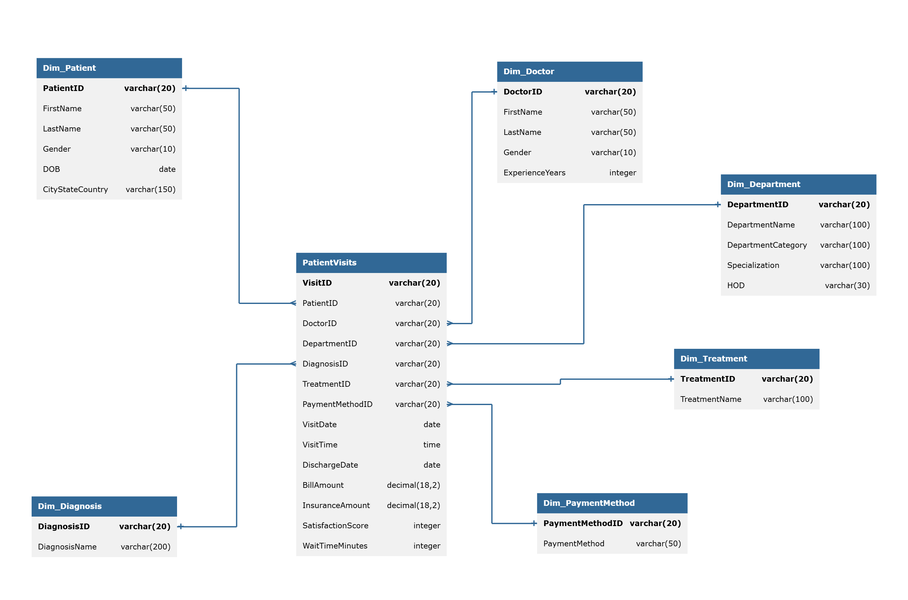

# 🏥 Hospital Patient Visits — SQL Data Warehouse & Analysis

An end-to-end SQL case study: designing a star-schema hospital database, 
cleaning raw source data, and answering operational business questions 
using CTEs, window functions, and conditional aggregation.

## 🗂️ Schema

Star schema with one fact table (`PatientVisits`) and six dimension tables 
(Patient, Doctor, Department, Diagnosis, Treatment, Payment Method).

## 🛠️ Tools
Microsoft SQL Server (T-SQL)

## 🧹 Data Cleaning
Raw data included intentional quality issues to practice on:
- Missing `FirstName` values in the patient table → removed
- Inconsistent gender codes (`M`/`F`) → standardized to `Male`/`Female`
- Combined `CityStateCountry` field → split into 3 columns using `PARSENAME`
- Incomplete department records (missing category/specialization) → filtered out
- Four separate yearly visit tables (2020–2025) → merged into one fact table via `UNION ALL`

## ❓ Business Questions Answered
1. Distinct patient count per doctor
2. Revenue and visit volume by payment method
3. Average bill amount by patient age band
4. Revenue and visit volume by department
5. Department revenue ranked within category
6. Average satisfaction score & wait time by department
7. Weekday vs. weekend visit volume
8. Monthly visits with running cumulative total
9. Doctors with highest satisfaction score (min. 100 visits)
10. Most commonly prescribed treatment per diagnosis

## 🧠 Techniques Demonstrated
- Star schema design with foreign key relationships
- String cleaning & parsing (`PARSENAME`, `LTRIM`/`RTRIM`, case conversion)
- `UNION ALL` for merging partitioned yearly tables
- Window functions (`RANK() OVER PARTITION BY`, running totals)
- CTEs for multi-step aggregation
- `HAVING` for post-aggregation filtering
- Age banding and custom `ORDER BY` sequencing with `CASE`

## 📁 Files
- `schema/01_create_tables.sql` — table definitions and relationships
- `data/02-04_*.sql` — source data inserts
- `cleaning/05_data_cleaning.sql` — cleaning and table consolidation
- `analysis/06_data_exploration_queries.sql` — all 10 analysis queries

---
*Part of my ongoing SQL practice — documenting patterns and building 
end-to-end data workflows while prepping for PL-300.*
